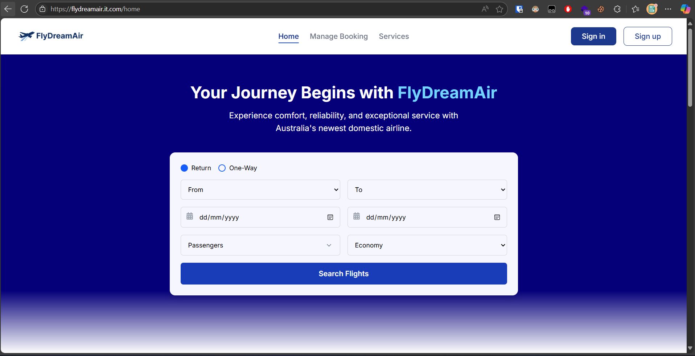
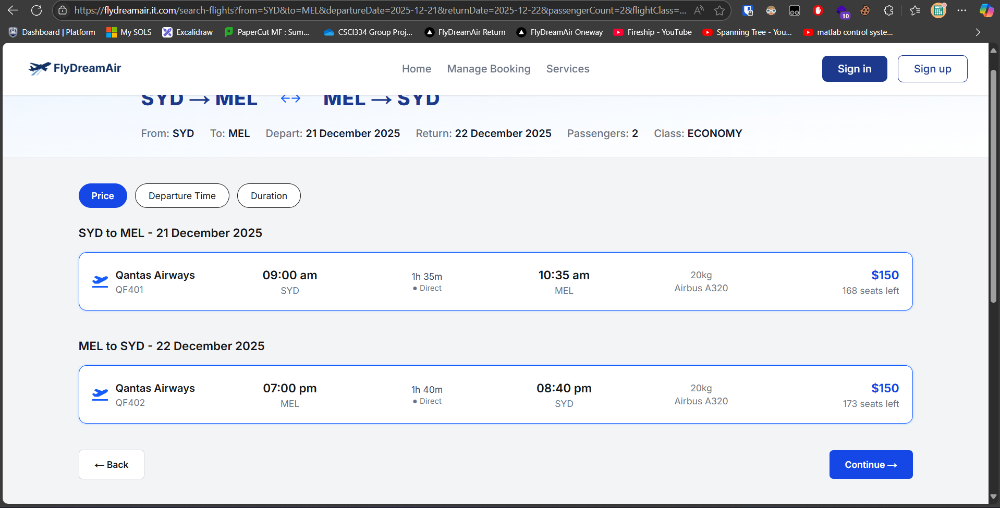

<a name="readme-top"></a>

<!-- PROJECT SHIELDS -->

[![Contributors][contributors-shield]][contributors-url]
[![Forks][forks-shield]][forks-url]
[![Stargazers][stars-shield]][stars-url]
[![Issues][issues-shield]][issues-url]
[![MIT License][license-shield]][license-url]

<br />
<div align="center">


<h3 align="center">FlyDreamAir</h3>

<p align="center">
    Redefining the Flight Experience
    <br />
    <br />
    <a href="https://github.com/MVPAV/FlyDreamAir">View Demo</a>
    ·
    <a href="https://github.com/MVPAV/FlyDreamAir/issues">Report Bug</a>
    ·
    <a href="https://github.com/MVPAV/FlyDreamAir/issues">Request Feature</a>
  </p>
</div>

<!-- TABLE OF CONTENTS -->

<details>
  <summary>Table of Contents</summary>
  <ol>
    <li>
      <a href="#about-the-project">About The Project</a>
      <ul>
        <li><a href="#built-with">Built With</a></li>
      </ul>
    </li>
    <li>
      <a href="#getting-started">Getting Started</a>
      <ul>
        <li><a href="#prerequisites">Prerequisites</a></li>
        <li><a href="#installation">Installation</a></li>
      </ul>
    </li>
    <li><a href="#usage">Usage</a></li>
    <li><a href="#roadmap">Roadmap</a></li>
    <li><a href="#contributing">Contributing</a></li>
    <li><a href="#contact">Contact</a></li>
  </ol>
</details>

<!-- ABOUT THE PROJECT -->

## About The Project

Conventional flight ticket ordering through airports and letters became a thing of the past long ago. In our current
modern world, the flight system has rapidly advanced and replaced the obsolete manual bookings with web-based
technology system, which allows clients to easily organise their complete travel experiences right on the palm of their
hand.

<br/>

Therefore, it's critically imperative for any flight management system to employ a systematic application to operate the
process of handling and managing bookings online. However, the intended system bears a significant complexity that might
Add an overhead that is not negligible.

<br />

This project is created as a comprehensive solution to develop a flight management system, including an extensive
range of features:

* Flight finding, selecting, and ordering
* Effortlessly complete the required information in a straightforward manner.
* Authentication and authorisation enabled with NextAuth
* In-built payment procedures handler, making interacting with 3rd-party clients easier than ever
* Email services with Postmark substantially enhance users' seamless personalisation.
* Pre-defined Postgres database schemas, capable of rapidly querying and mutating the data systematically
* Responsive to every device screen size, applicable to every device
* Completely type safe and type annotated by default with Prisma and tRPC, ensuring a seamless developer experience
* Administrative site with access level for unchallenged supervision

<!-- Use the `BLANK_README.md` to get started. -->

<p style="text-align: right;"><a href="#readme-top">back to top</a></p>

### Built With


<p style="text-align: right;"><a href="#readme-top">back to top</a></p>

<!-- GETTING STARTED -->

## Getting Started

### Prerequisites

#### Install requirements

```sh
npm i
```

#### Migrating database

Define your credentials URL in the .env file as DATABASE_URL, and Prisma will be able to locate and migrate the
programme schema into the DB. Most of the relational database systems are supported, including PostgreSQL, MySQL, and
SQL Server,
but parameters may have to be modified in the Prisma configuration. You can find it
at [prisma/schema.prisma](https://github.com/MVPAV/FlyDreamAir/blob/main/prisma/schema.prisma)

To merge the models into your database schema, simply run:

```sh
npx prisma migrate dev
```

#### Authentication

NextAuth required generating a local secret key before using it to ensure a secure process between JWT communications.
Luckily, the libraries make it easy for us to work on the local by running a single line.

```sh
npx auth
```

Which will generate a random key at your .env.local file. You are free to use it in your own development server.

However, deploying NextAuth required more than just that, since exposing the system to the public introduced
consequential risk to the system. Before production deployment, please refer to NextAuth Deployment
Guide [here](https://next-auth.js.org/deployment).

### Email Service

We use Postmark as the client for our email service. Even though sending mail is optional in the development system,
it's absolutely essential to have an email client in our real-world system. You can simply set this up to mirror the
production email workflow by defining your POSTMARK_CLIENT environment variable.

To get a POSTMARK_CLIENT key, you will have to sign up for [Postmark](https://postmarkapp.com/) and undergo their verification process. This
shouldn't take a long time to get it up and running.

### Local Storage

Not an imperative use case, but storing users' state in the local storage is an amazing enhancement to the workflow. We
use Zustland for your global state management, but ensure the development server has access to your browser's local
storage.

### Running the application

Simply run

```sh
npm run dev
```

To deploy the application on your localhost

### Building the application

```sh
npm run build
```

The software uses a set of linting and code quality checker tools, which might require you to resolve the issues before
generating the final production build to ensure optimisation and maximum efficiency.

<p style="text-align: right;"><a href="#readme-top">back to top</a></p>

<!-- USAGE EXAMPLES -->

## Usage



The application is presented with an intuitive interface, which can be explored further at our
domain [FlyDreamAir.it.com](FlyDreamAir.it.com)




<p style="text-align: right;"><a href="#readme-top">back to top</a></p>

<!-- ROADMAP -->

## Roadmap

- [X]  Bookings and Tickets Management
- [X]  Email Client
- [X]  Meals and Baggages Add-on Services
- [X]  Account Management

See the [open issues](https://github.com/MVPAV/FlyDreamAir/issues) for a full list of proposed features (and known
issues).

<p style="text-align: right;"><a href="#readme-top">back to top</a></p>

<!-- CONTRIBUTING -->

## Contributing

Contributions are what make the open source community such an amazing place to learn, inspire, and create. Any
contributions you make are **greatly appreciated**.

If you have a suggestion that would make this better, please fork the repo and create a pull request. You can also
simply open an issue with the tag "enhancement".

1. Fork the Project
2. Create your Feature Branch (`git checkout -b feature/AmazingFeature`)
3. Commit your Changes (`git commit -m 'Add some AmazingFeature'`)
4. Push to the Branch (`git push origin feature/AmazingFeature`)
5. Open a Pull Request

<p style="text-align: right;"><a href="#readme-top">back to top</a></p>
